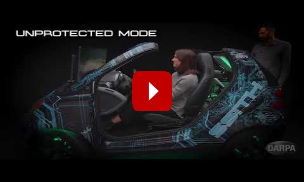

# Current / Prior Work

## CaseMark Co-Founder

## DARPA SSITH Cyber Car Demonstrator

I lead a team to build a car simulator in my garage during COVID for demonstrating novel hardware security technology.  The demonstrator is now housed in the [National Cryptologic Museum](https://www.nsa.gov/museum/). 

[Read More](https://galois.com/blog/2022/10/demonstrating-a-vehicle-that-thwarts-cyberattacks/)

## DARPA SSITH Voting Demonstrator

https://www.darpa.mil/news/2019/hacker-hardware-defcon-2019